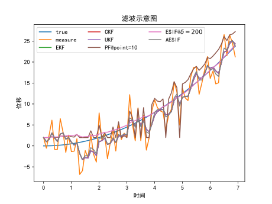

# 实现了以下滤波和算法
## 基础卡尔曼滤波
- 卡尔曼滤波（Kalman Filter, KF）
- 扩展卡尔曼滤波（Extended Kalman Filter, EKF）

参考：

[UnderstandingKalmanFilter.pdf](filters/References/UnderstandingKalmanFilter.pdf)

## Sigma-Point类型
- 容积卡尔曼滤波（Cubature Kalman Filter, CKF）
- 无迹卡尔曼滤波（Unscented Kalman Filter, UKF）
- 粒子滤波（Particle Filter, PF）

PS：找了一些参考，但有的实现不同，不太确定算法是否正确

参考：

[Cubature Kalman Filters.pdf](filters/References/Cubature_Kalman_Filters.pdf)

[Unscented Filtering and Nonlinear Estimation.pdf](filters/References/Unscented_Filtering_and_Nonlinear_Estimation.pdf)

## 最小二乘
- 递归最小二乘滤波（Recursive Least Square Filter）
- 递归最小二乘多项式系数拟合（Polynomial Fitting using Recursive Least Square）

## 滑动新息
- 滑动新息滤波（Sliding Innovation Filter, SIF）
- 扩展滑动新息滤波（Extended Sliding Innovation Filter, ESIF）
- 自适应滑动新息滤波（Adaptive Sliding Innovation Filter, ASIF）
- 自适应扩展滑动新息滤波（Adaptive Extended Sliding Innovation Filter, AESIF）

PS：2020年提出的新算法，从标准卡尔曼滤波改进而来，~~可以通过将 delta 变大将结果变得更平稳，但很明显这是掩耳盗铃~~


参考：

[The_Sliding_Innovation_Filter.pdf](filters/References/The_Sliding_Innovation_Filter.pdf)

[An_Adaptive_Formulation_of_the_Sliding_Innovation_Filter.pdf](filters/References/An_Adaptive_Formulation_of_the_Sliding_Innovation_Filter.pdf)

# 依赖
- numpy
- matplotlib

# 测试
## 单独测试
```shell
python ./filters/xxxFilter.py
```

`xxxFilter.py` 为具体的文件

# 一起测试

```shell
python ./filters/filters_all_together.py
```
或
```shell
python ./filters/test/test_all.py
```
选择匀加速直线运动，位移为观测量，结果如下图：



注：由于系统模型非线性， KF 和 SIF 不适用；最小二乘不需要基于系统模型也不适用

# 文件说明

 ```
.
├── Readme.md
└── filters
    ├── AbstractClass											抽象基类
    │   ├── AbstractExtendedFilter.py
    │   └── AbstractFilter.py
    ├── AdaptiveExtendedSlidingInnovationFilter.py				自适应扩展滑动新息滤波
    ├── AdaptiveSlidingInnovationFilter.py						自适应滑动新息滤波		
    ├── CubatureKalmanFilter.py									容积卡尔曼滤波
    ├── ExtendedKalmanFilter.py									扩展卡尔曼滤波
    ├── ExtendedSlidingInnovationFilter.py						扩展滑动新息滤波
    ├── KalmanFilter.py											卡尔曼滤波
    ├── ParticleFilter.py										粒子滤波
    ├── RecursiveLeastSquare.py									最小二乘
    ├── References												参考文档
    │   ├── An_Adaptive_Formulation_of_the_Sliding_Innovation_Filter.pdf
    │   ├── Cubature_Kalman_Filters.pdf
    │   ├── The_Sliding_Innovation_Filter.pdf
    │   ├── UnderstandingKalmanFilter.pdf
    │   └── Unscented_Filtering_and_Nonlinear_Estimation.pdf
    ├── SlidingInnovationFilter.py								滑动新息滤波
    ├── UnscentedKalmanFilter.py								无迹卡尔曼滤波
    ├── __init__.py
    ├── filters_all_together.py									滤波算法集中于一个文件
    ├── images
    │   └── all_together.svg									一起测试滤波算法的结果
    └── test													测试文件
        ├── GenerateData.py										生成匀加速数据
        ├── PlotFigure.py										单独绘图
        └── test_all.py											一起测试滤波算法
 ```

# 调用

```python
import numpy as np
from filters import xxxxFilter

...

def Fx():
    pass

def Hx():
    pass

xf = xxxFilter(X, P, Q, R, H, Fx, Hx)

xf_res = xf(Z, U, t)
xf_res = np.array(xf_res)[0]

...
```
具体请参考 `xxxFilter.py` 文件单独测试的样例

# 特别说明
能力有限，不确保全部都正确，仅供参考。代码写得垃圾，~~像屎一样~~，敬请谅解！

